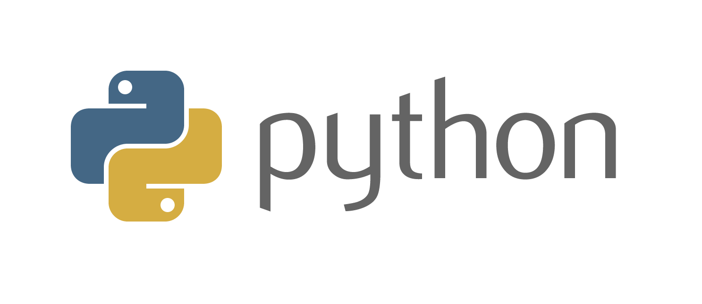

# **`Python`** 
## *teoría y práctica útil* 
### *Nahuel-DevOne⚡*

## *Información:*

### El proyecto es una recopilación de teoría y práctica de Python de distintos cursos, para comprender la sintaxis del lenguaje, desde básico a avanzado.
### Gran parte del contenido, pude armarlo gracias a los increíbles notebooks proporcionados en la `Diplomatura en Ciencia de Datos e IA de la UNSAM` por un equipo de profesores excelente, del curso de Python de `MoureDev`, y del curso de Udemy de `Andrei Neagoie`. 
### Además proporcioné ejemplos propios, recopilé datos e información útil de diversas fuentes en internet, y lo sigo haciendo para ampliar el material.

<!-- ## *Version 1.0.0:*

-  -->

## *Desarrollado con:*

- [Visual Studio Code](https://code.visualstudio.com/)
- [Jupyter](https://jupyter.org/)
- [Python](https://www.python.org/)

  <!-- Hecho con amor -->
### Hecho con ❤️... `Nahuel-DevOne`

