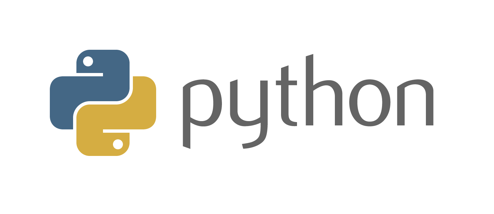

<section id="inicio" align="center">
    <h1>All About Python</h1>
    
    
<b>(From Zero to Little Ninja)</b>

</section>

<h2 align="start">Proyecto para aprender Python con Notebooks</h2>

### Tabla de Contenidos:

- [**Información del proyecto**](#información-del-proyecto) 📁
- [**Prerrequisitos**](#prerrequisitos) 📝
- [**Herramientas y tecnologías**](#herramientas-y-tecnologías) 🛠️
- [**Screenshots**](#screenshots) 📸
- [**Información adicional**](#información-adicional) 🪧
- [**Recomendaciones y agradecimientos**](#recomendaciones-y-agradecimientos) 👋🏽
- [**Cómo contribuir**](#cómo-contribuir) 🖐🏼
- [**Autor**](#autor) 🪪

## **Información del proyecto**

El proyecto comenzó como una recopilación de teoría y práctica de cursos y bootcamps que hice, para comprender la sintaxis del lenguaje, desde básico a avanzado, combinando conceptos teóricos con ejercicios y problemas.\
Parte del contenido se lo debo a los contenidos proporcionados en la `Diplomatura en Ciencia de Datos e IA de la UNSAM` por un equipo de profesores excelente, del curso de Python y de los ejercicios de `MoureDev`, de lo aprendido en Python de la plataforma de `Código Facilito`, de los cursos de Udemy que tomé como el de Ultimate Python de `Nicolas Schurmann` (Muy conocido su canal de Hola mundo en youtube), the complete Python Developer de `Andrei Neagoie`, entre muchos otros cursos y videos tutoriales.\
Otra gran parte es del esfuerzo de horas y horas de investigar y recopilar de distintas fuentes información útil y relevante para los notebooks, así como para generar ejemplos propios que puedan aportar contenido valioso a cada tema que he tratado.\
Esto es producto de mucho esfuerzo y tiempo de dedicación, para lograr un repositorio realmente útil para quién quiera comenzar a aprender Python desde cero y pueda tener a mano tanto los conceptos teóricos iniciales como ejercicios de programación que los acompañan, hasta conceptos teóricos avanzados con más ejercicios, estructuras de datos, patrones de diseño, principios SOLID, conexiones a bases de datos, librerías útiles y muchas cosas más. 

## **Prerrequisitos**

Ninguno, comienza desde cero.
Cualquier cosa que se necesite, se irá viendo en los notebooks.

## **Herramientas y tecnologías**

Tecnologías utilizadas para construir el proyecto:

- [Git](https://git-scm.com/) - El controlador de versiones utilizado
- [GitHub](https://github.com/) - La plataforma de desarrollo colaborativo, donde se aloja este proyecto.
- [Docker](https://www.docker.com/) - La tecnología de contenedores utilizada para manejar una imagen de airflow.
- [Python](https://www.python.org/) - El lenguaje de programación utilizado.
- [Pandas](https://pandas.pydata.org/) - Una librería  de Python para la manipulación y el análisis de los datos.
- [SQL](https://www.postgresql.org) - El lenguaje de consulta utilizado para bases de datos relacionales.
- [Snowflake](https://www.snowflake.com/es/) - La plataforma de almacenamiento de datos basada en la nube que fue utilizada. 
- [Airflow](https://airflow.apache.org/) - La plataforma de gestión de flujo (un orquestador) utilizada.

## **Screenshots**

En proceso...

## **Información adicional**

Nada por el momento, luego ampliaré.

## **Recomendaciones y agradecimientos**

### Agradecimientos 

Agradecimientos a todos aquellos divulgadores que dedican gran parte de su tiempo a enseñar online, democratizando el acceso a la educación, y haciendo posible que personas que no tenían la posibilidad de estudiar, ahora puedan hacerlo con verdaderos profesionales con trayectoria reconocida a nivel internacional, que con toda su humildad, comparten sus experiencias y conocimientos.\
Agradecimientos a la UNSAM (Universidad Nacional de San Martin) por compartir en su Diplomatura de Python, notebooks de materiales, que fueron de inspiración para hacer este proyecto.\
Agradecimientos a Código Facilito, plataforma de aprendizaje para desarrolladores, hecha por desarrolladores, que no para de ampliarse y perfeccionarse como plataforma, brindando cada vez más contenidos de calidad especializados, con profesores experimentados en la industria y a un costo notoriamente más bajo que el del mercado, para hacer más fácil el acceso a la educación y llegar a más personas.\
Agradecimientos, en particular, a todos aquellos que me sirvieron de inspiración para tomarme el tiempo de hacer este proyecto y devolver algo de todo lo que pude aprender y tomar de forma online, ya sea gratuito o de pago, porque me sirvió para mejorar profesionalmente, cambiar de trabajo y seguir desarrollándome en la industria, ya que nunca se deja de aprender.

### Recomendaciones

Esta sección voy a ampliarla, pero de momento recomiendo ampliamente para complementar este material y seguir aprendiendo Python a:

- Mouredev (Con decenas y decenas de horas de videos tutoriales, repositorios en GitHub con ejecicios, problemas y proyectos, una comunidad muy comprometida y activa, y temas relacionados al desarrollo y las buenas prácticas).
- Código Facilito (con los mejores cursos y bootcamps sobre Python).
- Nicolas Schurmann (Nico de Hola mundo), tiene cursos en Udemy, videos  tutoriales gratuitos, y una plataforma propia llamada "Hola mundo".
- La UNSAM (Universidad Nacional de San Martín)
- Andrei Neagoie, tiene cursos en Udemy y una plataforma propia.

## **Cómo contribuir**

Si la mejora o la contribución es relevante, acepto pull request para ampliar el proyecto, de momento no tengo ningún formato en específico.

## **Autor**

  

  <h3>¡Hola, mi nombre es <b><i>Nahuel</i></b> 👋🏽!!  </h3>
  
Soy de Buenos Aires (Argentina) y tengo formación en desarrollo con Python, Ingeniería y Ciencia de Datos. Me desempeño como Data Engineer en una empresa consultora, aunque en mi trabajo diario hago tanto ingeniería de datos como ciencia de datos, machine learning y desarrollo con Python.
   
  Amo el mundo de los datos pero también el desarrollo. Actualmente, estudio Ingeniería en Sistemas, y en mis momentos libres dedico gran parte de mi tiempo a seguir aprendiendo nuevas tecnologías, como así también a practicar y reforzar mi stack como Ingeniero de Datos.

Si quieres saber más sobre mí, puedes ir a mi perfil de GitHub:

  
💬 Siéntete libre de ponerte en contacto conmigo:

&nbsp;
&nbsp;

 

  
Desarrollado con 💙 por <i><b>NaLo Dev ထ</b></i>

 

